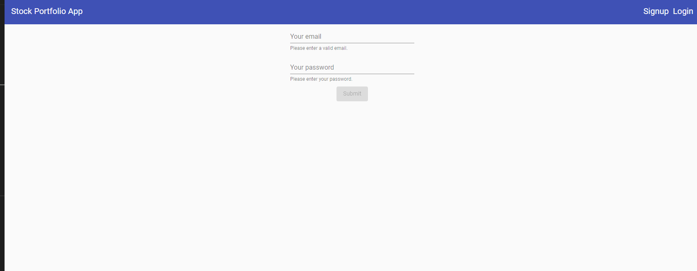

# FitnessTracker

This project was generated with [Angular CLI](https://github.com/angular/angular-cli) version 1.6.4.

## Development server

Run `ng serve` for a dev server. Navigate to `http://localhost:4200/`. The app will automatically reload if you change any of the source files.

## Code scaffolding

Run `ng generate component component-name` to generate a new component. You can also use `ng generate directive|pipe|service|class|guard|interface|enum|module`.

## Build

Run `ng build` to build the project. The build artifacts will be stored in the `dist/` directory. Use the `-prod` flag for a production build.

## Running unit tests

Run `ng test` to execute the unit tests via [Karma](https://karma-runner.github.io).

## Running end-to-end tests

Run `ng e2e` to execute the end-to-end tests via [Protractor](http://www.protractortest.org/).

## Further help

To get more help on the Angular CLI use `ng help` or go check out the [Angular CLI README](https://github.com/angular/angular-cli/blob/master/README.md).

## Project setup

1) Before run the project you must first create your firebase account

2) After the firebase project is created go to:
https://console.firebase.google.com/project/<my project>authentication/providers 
and enable your authentication provider for email/password

3) Go to the page: https://console.firebase.google.com/u/0/project/<my project>/overview and add a new app

4) Go to the project settings and copy your app keys config

5) replace the keys on the files envirionment.ts and envirionment.prod.ts

6) go to https://www.alphavantage.co/ and create your key 

7) replace the   alpha_advantage_api_key in envirionment and envirionment.prod.ts

8) run npm install

9) run npm start and the application should be served on the port http://localhost:4200/

## deploy the project in firebase

1) run ng build --prod

2) follow the instructions provided in the following page https://firebase.google.com/docs/hosting/quickstart

## After the application is deployed in firebase the user will be redirected to:

